# Compte rendu SAE 21 petit réseau de Tardieu Martin :

 

## Sommaire :

- Maquette du réseau sous cisco packet tracer [(O)](#1)
- Plan d'adressage choisi [(O)](#2)
- Configuration des interfaces liées aux routeurs [(O)](#3)
- Configuration des VLANs [(O)](#4)
- Configuration du DHCP [(O)](#5)
- Mise en place d'OSPF [(O)](#6)
- Mise en place du NAT [(O)](#7)
- Configuration des serveurs DNS et WEB [(O)](#8)
- Gestion des ACLs [(O)](#9)

 

---

 

## Maquette du réseau sous cisco packet tracer : 

 

- Pour la maquette j'ai décidé de reprendre la configuration qui m'avais été donné dans le sujet de la SAE. Mon réseau interne est donc colorié en fonction des différent services (commercial, adminsitratif et technique). J'ai connecté la majorité des équipements avec des liens 'Copper Straight-Through', mais sur le réseau opérateur et entre les deux switchs de mon réseau interne j'ai mis des câbles 'Copper Cross-Over' afin de permettre la communication entre les routeurs et switchs.

    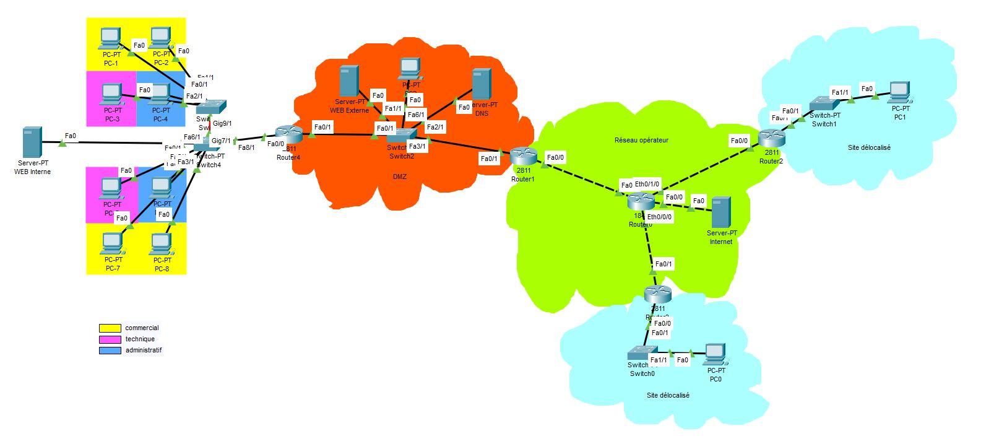

 

---

 

## Plan d'adressage choisi : 

 

- Quand au plan d'adressage je me suis d'abord posé la question de comment rendre mon réseau simple à comprendre lorsque l'on cherche à résoudre un problème technique à l'intérieur de celui-ci. J'ai d'abord commencé par mon réseau interne. Selon moi, l'adressage en /8 me parraissait le plus simple à comprendre si l'on a peut d'équipement à configurer. <b> J'ai donc choisi de mettre en place le réseau 10.0.0.0/8 dans mon réseau interne. </b> Mais avant de configurer mes équipements j'ai attendu de rentrer dans la phase de configuration des VLANs car je savais qu'il allait falloir faire des modifications. Je me suis donc penché sur la DMZ. Pour celle-ci, il m'était donné l'adressage publique 200.0.0.0/24. J'ai donc tout simplement configuré mes machines une par une en utilisant les adresses : <b>200.0.0.1/24 pour le serveur WEB Externe, 200.0.0.2/24 pour le PC du milieu, et 200.0.0.3 pour le serveur DNS.</b>

 

### Voici le processus utilisé pour la configuration de chaque équipement :

1. Accéder à l'interface de l'équipement en cliquant sur celui-ci,
2. Dans Config>Settings rentrer l'adresse de la passerelle ainsi que l'adresse du DNS :

    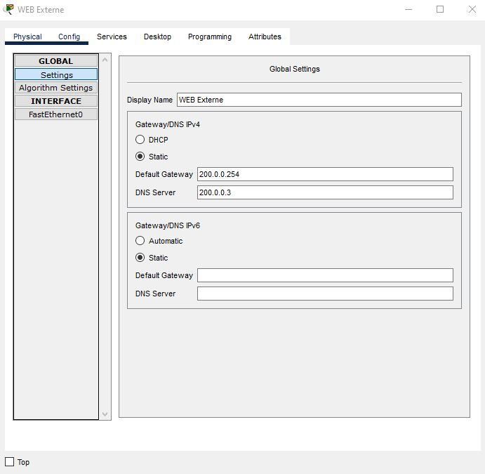

3. Dans Config>{nom de l'interface connectée}(FastEthernet0) rentrer l'adresse de l'équipement ainsi que son masque de sous réseau :

    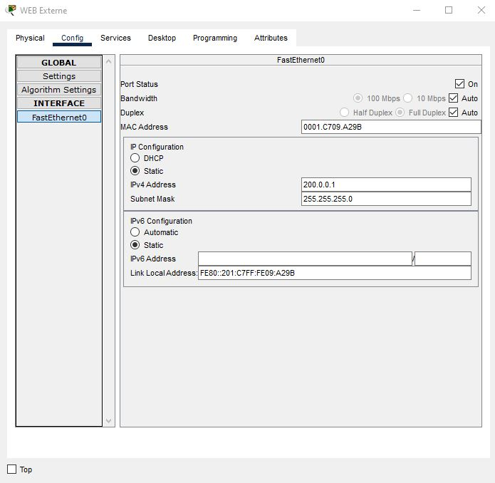

La configuration est la même pour les deux autres équipements juste en changeant l'adresse IPv4 de chacun.

    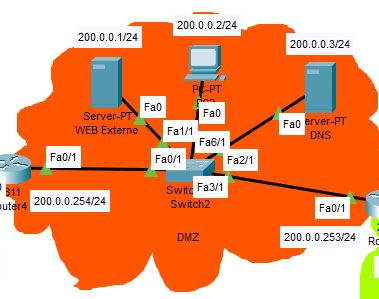

 

- J'ai par la suite utilisé un /30 pour le réseau opérateur avec les réseaux :

    - 192.168.1.0/30 (192.168.1.1 et 192.168.1.2)
    - 192.168.2.0/30 (192.168.2.1 et 192.168.2.2)
    - 192.168.3.0/30 (192.168.3.1 et 192.168.3.2)
    - 192.168.4.0/30 (192.168.4.1 et 192.168.4.2)

La configuration ressemble donc à ça :

    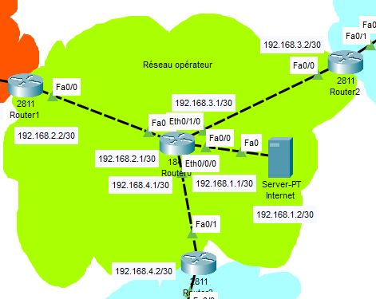

 

---

 

## Configuration des interfaces liées aux routeurs 

 

- Pour la configuration des interfaces liées aux routeurs la manipulation reste la même pour tous les routeurs :

    1. Accéder au routeur en cliquant sur celui-ci,
    2. Aller dans le CLI et tapez les commandes suivantes :

            Router#conf t (ou configure terminal)
            Router(config)#interface {nom de l'interface}(fa0/1)
            Router(config-if)#ip address {IPv4}(200.0.0.254) {masque}(255.255.255.0)
            Router(config-if)# no shut

- Ici j'ai montré comment j'ai configuré l'interface fa0/1 (FastEthernet0/1) du routeur de gauche de la DMZ. Cette configuration est semblable partout sauf pour l'interface du routeur reliée au réseau interne. En effet pour ce dernier cela va devenir un peu plus compliqué car nous allons devoir gérer des VLANs.

 

---

 

## Configuration des VLANs 

 

- Pour cette partie je me suis dans un premier temps penché sur les switchs du réseau local. J'ai d'abord vérifié si mes switchs avaient assez d'interface pour la connexion avec les autres équipements. Pour le switch 1 j'ai décidé de ne mettre que des interfaces FastEthernet (PT-SWITCH-NM-1CFE), qui sont situés dans Physical>PT-SWITCH-NM-1CFE. J'en ai donc un total de 5 :

 

    

 

- Quand au deuxième switch, j'ai également décidé de ne mettre que des FastEthernet mais ici j'en ai un total de 7 :

 

    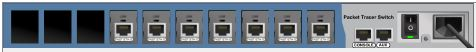

 

<!> Surtout ne pas oublier que pour changer les ports il faut d'abord éteindre le switch.

- J'ai ensuite décidé de changer mon plan d'adressage au niveau du réseau interne qui était 10.0.0.0/8, en 4 sous-réseaux :

    - 10.10.0.0/16 pour le service commercial,
    - 10.20.0.0/16 pour le service technique,
    - 10.30.0.0/16 pour le service administratif,
    - 10.40.0.0/16 pour le serveur web interne.

- Pour commencer ce changement d'adressage j'ai d'abord configuré mes deux switchs afin que les interfaces puissent savoir quel équipement fait partie de quel VLAN :

J'ai dans un premier temps accédé à la VLAN database située dans Config>Switching>VLAN database. J'y ai créé 4 VLANs qui sont les suivants :

 

    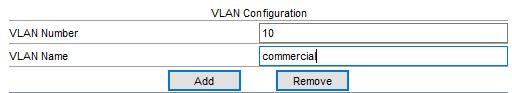
    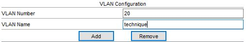

    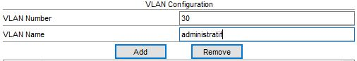
    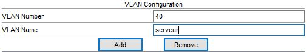

 

- Pour les deux switchs la configuration par de la même base. Les équipements appartenant à des VLANs doivent être connectés en mode access et les connexions entre équipements qui gèrent plusieurs VLANs doivent être en mode trunk (entre les deux switch et entre le switch et le routeur) :

 

### Interfaces en mode access :

 

- Pour la configuration en mode access il suffit de taper les commandes suivantes (exemple pour le VLAN 10) :

        Switch#conf t
        Switch(config)#interface {nom de l'interface que l'on veut connecter au VLAN10}(fa0/1)
        Switch(config-if)#switchport access vlan {id du vlan}(10)
        Switch(config-if)#no shut

 

### Interfaces en mode trunk :

 

- Pour la configuration en mode trunk il suffit de taper les commandes suivantes :

        Switch#conf t
        Switch(config)#interface {nom de l'interface que l'on veut connecter en trunk}(fa0/5)
        Switch(config-if)#switchport mode trunk
        Switch(config-if)#no shut

 

On passe maintenant à la configuration du routeur :

 

- J'ai décidé de créer des sous-interfaces pour pouvoir gérer les différents flux des VLANs. L'interface que l'on va utiliser est celle côté réseau interne soit fa0/0. Pour configurer les 3 sous-interfaces j'ai répété la même opérations en changeant les ip des sous-réseaux (exemple avec le VLAN 10) :

        Router#conf t
        Router(config)#interface fa0/0.{id du VLAN}(10)
        Router(config-subif)#ip address 10.10.0.254 255.255.0.0
        Router(config-subif)# no shut

 

<!> Il faut faire attention à ne pas mettre d'ip sur l'interface fa0/0.

 

---

 

## Configuration du DHCP 

 

- Pour cette partie je me suis focalisé sur les sous-interfaces créées précédement. On commence par créer un dhcp par VLAN (exemple avec le VLAN 10) :

        Router#conf t
        Router(config)#ip dhcp pool VLAN10
        Router(dhcp-config)#network 10.10.0.0 255.255.0.0
        Router(dhcp-config)#default-router 10.10.0.254
        Router(dhcp-config)#dns-server 200.0.0.3
        Router(dhcp-config)#domain-name flopland.fr

- Maintenant que chaque VLAN à son dhcp (VLAN 10 au VLAN 40), on va pouvoir mettre des balises VLAN avec les commandes :

        Router#conf t
        Router(config)#interface fa0/0.10
        Router(config-subif)#encapsulation dot1Q 10

        Router(config)#interface fa0/0.20
        Router(config-subif)#encapsulation dot1Q 20

        Router(config)#interface fa0/0.30
        Router(config-subif)#encapsulation dot1Q 30

        Router(config)#interface fa0/0.40
        Router(config-subif)#encapsulation dot1Q 40

 

---

 

## Mise en place d'OSPF 

 

- Pour mettre en place la communication des routeurs par le biais de OSPF, il faut répéter cette opération sur tous les routeurs que l'on souhaite configurer (exemple pour le routeur du réseau interne) :

        Router#conf t
        Router(config)#router ospf 1
        Router(config-router)#router id {id du routeur de la forme x.x.x.x}(1.1.1.1 pour le routeur du réseau interne)
        Router(config-router)#network {adresse réseau de l'interface}(200.0.0.0) {wildcard}(0.0.0.255) area 0
        Router(config-router)#network 10.10.0.0 0.0.255.255 area 0
        Router(config-router)#network 10.20.0.0 0.0.255.255 area 0
        Router(config-router)#network 10.30.0.0 0.0.255.255 area 0
        Router(config-router)#network 10.40.0.0 0.0.255.255 area 0

 

- Mes 5 routeurs ont donc pour ID 1.1.1.1, 2.2.2.2, 3.3.3.3, 4.4.4.4 et 5.5.5.5. On ajoute maintenant la config sur les interfaces :

        Router#conf t
        Router(config)#interface fa0/1
        Router(config-if)#ip ospf 1 area 0

 

- A noter que cette commande doit être répétée sur toutes les interfaces où l'on veut ajouter ospf.

 

---

 

## Mise en place du NAT 

 

- Pour mettre en place la traduction d'adresse (NAT) sur le routeur interne il nous suffit de procéder de la manière suivante :

    - Sur les interfaces internes :

            Router#conf t
            Router(config)#interface fa0/0.10
            Router(config-if)#nat inside

            Router(config)#interface fa0/0.20
            Router(config-if)#nat inside

            Router(config)#interface fa0/0.30
            Router(config-if)#nat inside

            Router(config)#interface fa0/0.40
            Router(config-if)#nat inside

    - Sur l'interface externe :

            Router#conf t
            Router(config)#interface fa0/1
            Router(config-if)#nat outside

 

---

 

## Configuration des serveurs DNS et WEB 

 

- Pour le DNS on clique sur le serveur DNS et on va dans Services>DNS. On rentre ensuite la configuration suivante :

    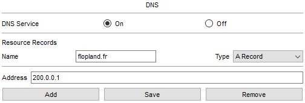

 

- 200.0.0.1 est l'adresse du serveur WEB externe et flopland.fr est le nom de domaine. Pour le serveur WEB on va dans Services>HTTP et on active le HTTP et le HTTPS :

    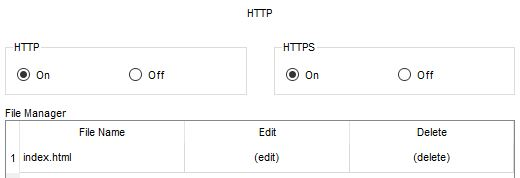

 

---

 

## Gestion des ACLs 

 

- Les ACLs sont situés au niveau du routeur du réseau interne. Je vais sectionner cette configuration en 3 parties qui représentent les 3 VLANs ayant des interdictions et permissions :

    - service commercial :

            Router#conf t
            Router(config)#ip access-list extended commercial
            Router(config-ext-nacl)#deny icmp 10.10.0.0 0.0.255.255 10.20.0.0 0.0.255.255 echo
            Router(config-ext-nacl)#permit udp any eq bootpc any eq bootps 
            Router(config-ext-nacl)#permit udp any eq bootps any eq bootpc (ces deux lignes servent pour le DHCP)
            Router(config-ext-nacl)#permit icmp 10.10.0.0 0.0.255.255 10.20.0.0 0.0.255.255 echo-reply
            Router(config-ext-nacl)#deny icmp 10.10.0.0 0.0.255.255 10.30.0.0 0.0.255.255 echo
            Router(config-ext-nacl)#permit icmp any any
            Router(config-ext-nacl)#permit ip any any
    
    - service technique :

            Router#conf t
            Router(config)#ip access-list extended technique
            Router(config-ext-nacl)#permit icmp 10.20.0.0 0.0.255.255 10.10.0.0 0.0.255.255 echo
            Router(config-ext-nacl)#permit udp any eq bootpc any eq bootps
            Router(config-ext-nacl)#permit udp any eq bootps any eq bootpc
            Router(config-ext-nacl)#permit icmp 10.20.0.0 0.0.255.255 10.30.0.0 0.0.255.255 echo
            Router(config-ext-nacl)#permit icmp 10.20.0.0 0.0.255.255 10.40.0.0 0.0.255.255 echo
    
    - service administratif :

            Router#conf t
            Router(config)#ip access-list extended administratif
            Router(config-ext-nacl)#deny icmp 10.30.0.0 0.0.255.255 10.10.0.0 0.0.255.255 echo
            Router(config-ext-nacl)#deny icmp 10.30.0.0 0.0.255.255 10.20.0.0 0.0.255.255 echo
            Router(config-ext-nacl)#permit udp any eq bootpc any eq bootps
            Router(config-ext-nacl)#permit udp any eq bootps any eq bootpc
            Router(config-ext-nacl)#permit icmp 10.30.0.0 0.0.255.255 10.20.0.0 0.0.255.255 echo-reply
            Router(config-ext-nacl)#permit icmp any any
            Router(config-ext-nacl)#permit ip any any

   

---

 

## Vérification de fonctionnement

 

- Pour tester que mon réseau fonctionnait correctement j'ai réalisé des tests de fonctionnement. Voici la liste :

    - ping les PC d'un même VLAN pour voir si la communication est possible dans un même VLAN (ok),
    - ping 200.0.0.254 depuis le VLAN 20 pour voir si le service technique ne peut pas sortir du réseau local (ok),
    - ping les autres VLANs depuis le VLAN 20 pour vérifier que le service technique a accès à tout le réseau interne (ok),
    - ping le serveur représentant internet (192.168.1.1) depuis le VLAN 10 ou le VLAN 30 pour voir si ils ont accès à l'extérieur (ok),
    - prendre un appareil du VLAN 10 ou du VLAN 30 pour voir si on peut accéder au serveur WEB externe (200.0.0.1) en tapant l'adresse flopland.fr, fournie par le DNS, sur un navigateur (ok),
    - ping le serveur WEB interne depuis n'importe quel VLAN pour voir si il est accessible à tout le réseau interne (ok)
    - essayer de relancer le dhcp depuis un appareil du réseau interne pour voir si le dhcp distribue correctement les adresses (ok),
    - faire un show ip database pour vérifier que tous les routeurs sont bien configurés en OSPF (ok),
    - essayer de ping depuis l'extérieur vers le réseau interne pour voir si les paquet ne peuvent pas rentrer (pas ok).
